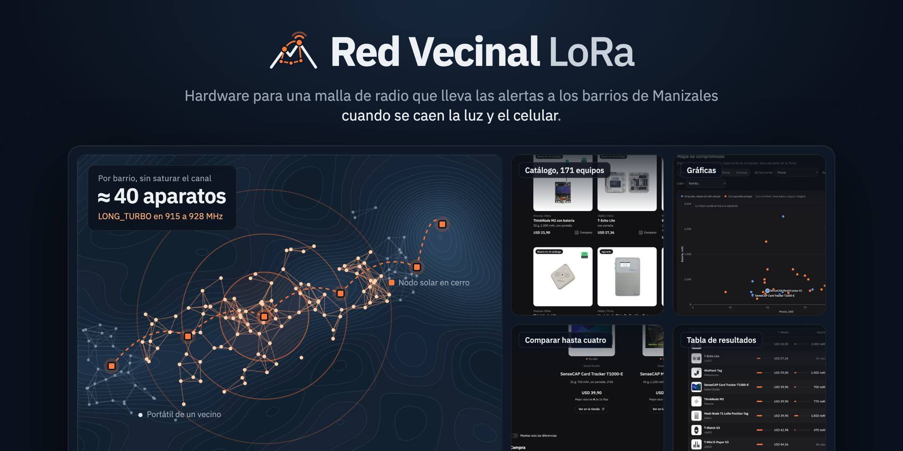

<p align="center">
  <picture>
    <source media="(prefers-color-scheme: dark)" srcset="assets/readme/logo-oscuro.png">
    
  </picture>
</p>

<p align="center">
  Comparador de radios LoRa y Meshtastic para armar una red de alertas en Manizales<br>
  que siga funcionando cuando se va la luz y se cae el celular.
</p>

<p align="center">
  <a href="https://tjimenez1303.github.io/hardware-red-vecinal/">Abrir el sitio</a> |
  <a href="docs/densidad.md">Estudio de densidad</a> |
  <a href="FUENTES.md">Fuentes</a>
</p>

<p align="center">
  
</p>

## De qué se trata

Manizales vive en laderas. Cuando llueve fuerte, el Sistema de Alerta Temprana de la
ciudad y el SISMAN-LISA emiten alertas. El problema es el último tramo: si la emergencia tumba la energía y las antenas de
celular, la alerta no le llega a la persona que vive en la ladera.

La Red Vecinal LoRa es una idea de AI Tinkeres Manizales para cubrir ese tramo. Son
radios pequeños que hablan entre sí sin internet y sin operador, con el firmware
abierto [Meshtastic](https://meshtastic.org). Unos van fijos en postes y azoteas con
panel solar. Otros los carga la gente en el bolsillo. Cada aparato repite lo que oye,
así que un mensaje salta de vecino en vecino hasta cubrir el barrio. La red no detecta
nada ni decide niveles de alerta. Solo entrega lo que el sistema oficial ya calculó.

Este repositorio es la parte de compras. Antes de gastar plata en aparatos
necesitábamos saber qué existe, cuánto cuesta de verdad, qué se consigue en Colombia y
cuántos equipos aguanta un barrio antes de que la red se sature.

## Lo que hemos encontrado

Hasta el 30 de septiembre de 2026 revisamos 171 equipos de 20 fabricantes. Casi todos
son de Shenzhen y Chengdu, en China. Algunos hallazgos que cambian la forma de comprar:

- Un barrio aguanta unos 40 aparatos que retransmiten al mismo tiempo. Por encima, el
  canal se empieza a llenar en una emergencia y conviene que el resto quede en modo
  de solo escucha. Es una cifra de diseño que sale de umbrales del firmware y de un
  cálculo propio, no de una medición en campo. El detalle está en
  [docs/densidad.md](docs/densidad.md).
- La norma colombiana pide un ancho de banda mínimo de 500 kHz, y el único perfil de
  Meshtastic que lo cumple es `LONG_TURBO`. La comunidad Meshtastic Colombia usa otro
  perfil, y los dos no se oyen entre sí. Esa decisión le toca al proyecto.
- Ningún fabricante de estos radios tiene tienda en Colombia. Todo se importa, y al
  precio de lista hay que sumarle envío e impuestos.
- La potencia que anuncia el fabricante no siempre es la que certificó. Revisamos el
  registro de 20 equipos en la FCC, y la mayoría de los de LilyGO y Heltec anuncian
  22 dBm pero pasaron la prueba con menos de 8 dBm. El sitio muestra las dos cifras
  por separado.
- En AliExpress la tienda oficial no siempre es más barata que la del fabricante, y
  tres equipos de LilyGO en versión de 915 MHz no se despachan a Colombia.

Las dos familias de aparatos portátiles, la etiqueta que depende del celular y el
aparato con pantalla propia, están comparadas en
[docs/familias-portatiles.md](docs/familias-portatiles.md).

## El sitio

Está en <https://tjimenez1303.github.io/hardware-red-vecinal/> y tiene cinco páginas:

| Página | Qué hace |
|---|---|
| Catálogo | Todos los equipos con foto, precio y enlace a la tienda. Tiene filtros por rango y un buscador que entiende cosas como `precio<50 peso<100 tiene:pantalla pais:china`. Al tocar un equipo se abre su ficha completa encima del catálogo. |
| Tabla | Las cifras en una cuadrícula que se ordena por cualquier columna. |
| Comparar | Hasta cuatro equipos lado a lado. En cada fila el mejor valor va en negrilla. |
| Asistente | Unas preguntas sobre para quién es el aparato y dónde va a estar, y una recomendación con dos alternativas. |
| Gráficas | Precio contra batería, rendimiento por dólar, precios por capa y cómo queda un equipo frente a los de su tipo. |

Todo es HTML, CSS y JavaScript sin dependencias ni paso de compilación.

## Verlo en tu computador

El navegador no deja leer el archivo de datos si abres la página directamente, así
que hay que servir la carpeta:

```bash
python3 -m http.server 8000
```

Después abre <http://localhost:8000>.

## Cómo está organizado

```
index.html, tabla.html, comparar.html, asistente.html, graficas.html
assets/comun.js          datos, filas de comparación, barra y tema claro u oscuro
assets/comun.css         colores y piezas compartidas
assets/img/              una foto por equipo, bajada de la ficha del fabricante
assets/readme/           logo y portada de este README
datos/equipos.json       todos los datos del catálogo
FUENTES.md               de dónde sale cada precio y cada dato
docs/                    estudio de densidad y comparación de las familias portátiles
herramientas/fuentes.py  vuelve a generar FUENTES.md a partir del JSON
herramientas/readme/     el HTML con el que se dibujaron el logo y la portada
```

## De dónde salen los datos

Cada precio se leyó en la tienda del fabricante o de su distribuidor oficial, con la
dirección de la ficha y la fecha de consulta. En las tiendas Shopify se lee el JSON de
la ficha, y en las demás el precio publicado en la página. Los de AliExpress se
leyeron con un navegador, eligiendo la variante de 915 MHz y mirando el envío a
Colombia. Los datos técnicos que faltaban en las fichas se buscaron en manuales, wikis
y registros de la FCC. Todo queda anotado en [FUENTES.md](FUENTES.md).

Los precios son de lista en dólares y no incluyen importación. La tasa de referencia
es de 3.140,55 pesos por dólar, del Banco de la República el 3 de septiembre de 2026.

Seguimos unas reglas que no negociamos:

1. Un precio sin enlace al vendedor y sin fecha no se publica. La página lo muestra
   como «Sin dato» y lo deja por fuera de las gráficas.
2. Si el fabricante no publica un dato, queda vacío. No lo llenamos con una
   estimación.
3. Cuando dos fuentes no coinciden, se muestran las dos en el campo `contradiccion`.
4. No citamos una fuente que no hayamos abierto.
5. Los precios que muestran los buscadores no sirven porque suelen ser copias viejas.
   Hay que abrir la ficha.

## Cómo actualizar

Para cambiar un precio, abre la ficha del equipo, copia el precio viejo a
`precio_anterior_usd` y actualiza `precio_usd`, `disponibilidad` y `fecha_consulta`
en `datos/equipos.json`. En las tiendas Shopify, agregar `.js` al final de la
dirección del producto devuelve el precio y el stock de cada variante.

Para agregar un equipo, dale un `id` en minúsculas con guiones, guarda su foto en
`assets/img/<id>.jpg` y pon esa ruta en el campo `imagen`. En macOS se reduce así:

```bash
sips -s format jpeg -s formatOptions 82 -Z 800 original.png --out assets/img/<id>.jpg
```

Cuando termines, vuelve a generar las fuentes:

```bash
python3 herramientas/fuentes.py
```

Las filas de la comparación están en `GRUPOS`, dentro de `assets/comun.js`. Los
filtros del catálogo están en `NUM` y `BOOL`, dentro de `index.html`. Las preguntas
del asistente están en `PREGUNTAS`, dentro de `asistente.html`.

Cada `git push` a `main` vuelve a publicar el sitio en uno o dos minutos. Si ves la
versión anterior, agrega un `?v=` distinto a `assets/comun.css` y `assets/comun.js`
en las cinco páginas.

## Contribuir

Si encuentras un precio desactualizado, un equipo que falta o un dato mal copiado,
abre un issue con el enlace a la ficha. Si quieres corregirlo tú:

1. Haz un fork del repositorio.
2. Crea una rama, por ejemplo `git checkout -b precio-t1000e`.
3. Haz el cambio en `datos/equipos.json` con su enlace y su fecha.
4. Abre un pull request contando qué cambiaste y de dónde salió.

## Quiénes somos

AI Tinkeres Manizales es una comunidad de gente que arma cosas con tecnología en
Manizales, Caldas. La Red Vecinal LoRa es uno de nuestros proyectos.

## Licencia

El código usa la licencia [MIT](LICENSE). Los datos, los textos de `docs/` y
`FUENTES.md`, el logo y la portada usan
[CC BY 4.0](LICENSE-DATOS.md): puedes reutilizarlos citando a AI Tinkeres Manizales.
Las fotos de los equipos son de sus fabricantes y quedan por fuera de las dos
licencias.
